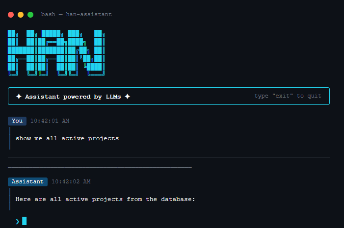

<div align="center">

```
██╗  ██╗ █████╗ ███╗   ██╗
██║  ██║██╔══██╗████╗  ██║
███████║███████║██╔██╗ ██║
██╔══██║██╔══██║██║╚██╗██║
██║  ██║██║  ██║██║ ╚████║
╚═╝  ╚═╝╚═╝  ╚═╝╚═╝  ╚═══╝
```

### **Your terminal. Now with a brain.**

*LLM-powered CLI assistant with real PC access, multi-provider AI, and natural language shell control.*

<br>

[](https://nodejs.org)
[](LICENSE)
[](https://anthropic.com)
[](https://deepmind.google/gemini)
[](https://openai.com)

<br>



</div>

---

## 🧠 What is HAN?

HAN is a **terminal-based AI assistant** that goes beyond just answering questions. It can *act* — executing real shell commands on your machine, querying your database with plain English, and remembering your conversation context — all from a single terminal prompt.

Think of it as a CLI copilot that actually does things.

---

## ✨ Features at a glance

<table>
<tr>
<td width="50%">

### 🤖 Multi-Provider AI
Switch freely between **Claude**, **Gemini**, and **GPT** with a single config change. No code changes needed.

</td>
<td width="50%">

### 💻 Real PC Access
HAN can run shell commands on your machine — open apps, manage files, clone repos, and more — using plain language.

</td>
</tr>
<tr>
<td width="50%">

### 🗄️ NLP → SQL
Describe what you want from your database in plain English. HAN converts it to safe, parameterized MySQL queries automatically.

</td>
<td width="50%">

### 🔄 Streaming Output
Responses appear in real-time with a typewriter effect, markdown rendering, and live token usage tracking in the terminal.

</td>
</tr>
<tr>
<td width="50%">

### 🧩 Skill System
Drop a `.md` file into `agents/skills/` and HAN immediately gains new capabilities — no restarts, no code changes.

</td>
<td width="50%">

### 🧵 Smart History
Rolling context window with automatic summarization keeps conversations coherent without burning tokens.

</td>
</tr>
</table>

---

## ⚡ Quick Start

```bash
# 1. Clone
git clone https://github.com/TsumuX/han.git && cd han

# 2. Install
npm install

# 3. Setup (creates config.json, .env, and skills folder)
npm run setup

# 4. Add your API key to agents/config.json
# 5. Launch
npm start
```

> **Global install** — use HAN from anywhere:
> ```bash
> npm install -g .
> start-han   # launch
> setup-han   # reconfigure
> ```

---

## ⚙️ Configuration

Open `agents/config.json` after setup and fill in your credentials:

```json
{
  "current-provider": "claude",
  "current-models":   "claude-sonnet-4-5",
  "claude-api-key":   "YOUR_KEY_HERE",
  "gemini-api-key":   "",
  "openai-api-key":   "",
  "stream-response":  true
}
```

**Supported providers:**

| Provider | `current-provider` | Example model |
|---|---|---|
| 🟠 Anthropic Claude | `claude` | `claude-sonnet-4-5` |
| 🔵 Google Gemini | `gemini` | `gemini-2.0-flash` |
| 🟢 OpenAI GPT | `openai` | `gpt-4o-mini` |

You only need to fill in the key for the provider you're using.

---

## 💻 Shell Command Execution

> ⚠️ **HAN has real access to your PC.** It runs shell commands using your current user's permissions — the same things you can do in a terminal, HAN can do too. Use with care.

This is HAN's most powerful feature. When it detects a system-level task in your prompt, it doesn't just describe what to do — it **does it**.

### How it works, step by step

```
You type something
        │
        ▼
  ┌─────────────────────────────────────────┐
  │  1. INTENT CHECK                        │
  │     LLM decides: shell task or chat?    │
  └────────────────┬────────────────────────┘
                   │
       ┌───────────┴───────────┐
       ▼                       ▼
  Shell Task               Conversation
       │                       │
       ▼                       ▼
  ┌──────────────┐      ┌──────────────────┐
  │ 2. GENERATE  │      │  stream response │
  │  LLM builds  │      │  with history    │
  │  task list + │      └──────────────────┘
  │  commands    │
  └──────┬───────┘
         │
         ▼
  ┌──────────────┐
  │ 3. EXECUTE   │
  │  run on PC   │
  │  (10s limit) │
  └──────┬───────┘
         │
         ▼
  ┌──────────────────────────────┐
  │ 4. SELF-CORRECTION LOOP      │
  │  failed? → LLM fixes it      │
  │  done?   → stop              │
  │  more?   → continue          │
  │  max 3 rounds                │
  └──────────────────────────────┘
```

### What HAN can do on your machine

| Category | Examples |
|---|---|
| 📁 **Files & Folders** | Create, move, rename, copy, delete anything |
| 🚀 **Launch Apps** | Open browsers, editors, apps by name |
| 🌐 **Web** | Open URLs, run curl, check connectivity |
| 🛠️ **Dev Tools** | Run `npm`, `git`, `python`, compilers, build tools |
| 🔍 **System Info** | Disk usage, running processes, env variables |
| 🔗 **Automation** | Chain multi-step tasks from a single prompt |

### See it in action

```
❯ create a folder called "projects" on my desktop and open it
```
```cmd
mkdir "%USERPROFILE%\Desktop\projects"
start "" "%USERPROFILE%\Desktop\projects"
✔ Done in 1 round
```

---

```
❯ clone https://github.com/user/repo into my documents
```
```cmd
cd "%USERPROFILE%\Documents" && git clone https://github.com/user/repo.git
✔ Done in 1 round
```

---

```
❯ find and delete all .tmp files in C:\Temp
```
```
Round 1 → command fails (access denied on some files)
Round 2 → LLM adjusts approach with error handling
Round 3 → success ✔
```

### Limitations to know

- 🪟 Targets **Windows CMD** by default — edit `SYSTEM_GENERATE` in `shell-command.js` for Linux/macOS
- 🔒 Runs as **your user** — no privilege escalation
- ⏱️ **10 second timeout** per command — may be too short for large downloads or installs
- 🚫 **No sandbox or whitelist** — HAN is as powerful (and risky) as your own terminal

---

## 🗄️ NLP to SQL

When paired with a MySQL database, HAN can interpret natural language and convert it into safe, parameterized queries — no SQL knowledge needed.

```
❯ show all active projects
→ SELECT * FROM `proyek` WHERE `status` = ?  ['active']

❯ mark task 42 as done
→ UPDATE `work` SET `status` = ? WHERE `id` = ?  ['done', 42]

❯ delete the paint task
→ ⚠ Ambiguous — 3 tasks match. Confirmation required.
```

Queries with **low confidence** or **ambiguous matches** are flagged before execution. Nothing runs without your go-ahead.

Configure your database in `.env`:

```env
DATABASE_HOST=localhost
DATABASE_USER=root
DATABASE_PASSWORD=yourpassword
DATABASE_NAME=yourdb
```

---

## 🧩 Skills

Skills are plain `.md` files that get injected into every system prompt. They teach HAN how to behave for specific tasks.

```
agents/skills/
  ├── nlp.md          ← built-in: NLP-to-SQL
  └── your-skill.md   ← drop any .md here
```

A skill file typically contains:
- What the skill does
- Expected input/output format
- Examples

HAN picks it up automatically on next launch.

---

## 🗂️ Project Structure

```
han/
├── agents/
│   ├── models/
│   │   ├── base-model.js      ← abstract base for all providers
│   │   ├── Anthropic.js       ← Claude
│   │   ├── Google.js          ← Gemini
│   │   └── OpenAi.js          ← GPT
│   ├── skills/                ← drop .md files here
│   ├── utils/
│   │   ├── config.js          ← read/write config
│   │   ├── history.js         ← conversation memory
│   │   ├── insturctor.js      ← NLP-to-SQL engine
│   │   ├── load-skills.js     ← skill loader
│   │   └── shell-command.js   ← PC execution engine ⚡
│   └── response.js            ← main pipeline
├── core/
│   └── utils/
│       ├── deploySQL.js       ← MySQL pool
│       └── files.js           ← filesystem helpers
├── UI/
│   └── UI.js                  ← terminal renderer
├── index.js                   ← entry point
├── cli.js                     ← CLI wrapper
└── setup.js                   ← first-time setup
```

---

## 📋 Config Reference

### `agents/config.json`

| Key | Type | Description |
|---|---|---|
| `current-provider` | `string` | Active provider: `claude` / `gemini` / `openai` |
| `current-models` | `string` | Model string passed to the API |
| `claude-api-key` | `string` | Anthropic API key |
| `gemini-api-key` | `string` | Google API key |
| `openai-api-key` | `string` | OpenAI API key |
| `stream-response` | `boolean` | Typewriter streaming output |

### `.env`

| Key | Description |
|---|---|
| `DATABASE_HOST` | MySQL host |
| `DATABASE_USER` | MySQL username |
| `DATABASE_PASSWORD` | MySQL password |
| `DATABASE_NAME` | Database name |

---

<div align="center">

**MIT License © 2026 TsumuX**

*Built for people who live in the terminal.*

</div>